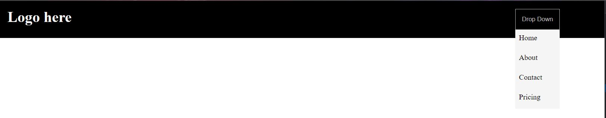

# Dropdown Component using css
This is a dropdown component created using vanilla css. A simple example of the combined usage of hover-states and display.

[**click here to view the component**]()
&nbsp;

# screenshots 

&nbsp;

# Technology Stack
- HTML
- CSS

&nbsp;

# Credits
- This drop-down component is done as a part of my Front end curriculum at Aekam Labs, Coimbatore.
